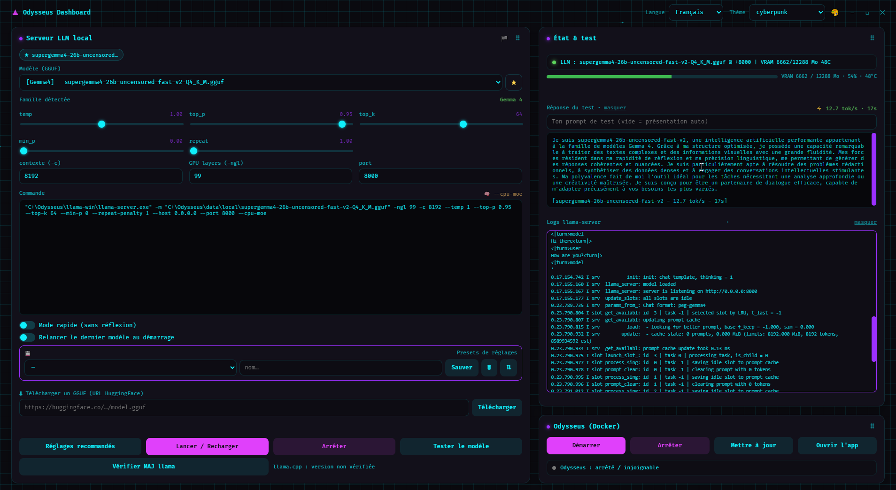

**English** · [Français](README_FR.md)

# Odysseus Dashboard

> A native control center for [Odysseus](https://github.com/pewdiepie-archdaemon/odysseus) — **and a full local-LLM launcher in its own right.** A frameless WebView2 window, driven by a PowerShell backend, that reuses Odysseus's themes and animated backgrounds. No terminal, no config files — point it at your GGUF folder and go.



<p align="left">
  
  
  
  
  
</p>

Built by **David (PalpatineRex)**, assisted by Claude. Free for anyone to use. This is an **unofficial** addon — it is not affiliated with the Odysseus project.

---

## What it is

Odysseus Dashboard is a single-window desktop app for Windows. It does two jobs:

- **Launch and tune a local LLM** — a native `llama-server` (llama.cpp) on your GPU — without ever touching a command line.
- **Drive the [Odysseus](https://github.com/pewdiepie-archdaemon/odysseus) stack** (Docker) — start, stop, update and open the app from one place.

The window is a real Odysseus look-alike: it imports the project's actual `theme.js`, the same palettes, the same animated background effects and the same **Fira Code** font. The "system" side — scanning files, starting processes, reading the GPU — runs in **PowerShell** behind a full-screen WebView2.

Because Odysseus auto-discovers a `llama-server` on `host.docker.internal:8000`, the LLM you launch here becomes the model Odysseus talks to — the integration is seamless. But you don't need Odysseus at all: the launcher stands on its own.

## Two ways to use it

### 1. With Odysseus
Built-in Docker buttons start / stop / update the stack and open the app at `http://localhost:7000`. Launch a model in the dashboard and Odysseus picks it up automatically on `:8000`.

### 2. Standalone — just a local LLM launcher
Without Odysseus, use it purely to drive your local models. Everything below works on its own.

---

## Features

### Model discovery & presets
- **Automatic GGUF scan** of `data\huggingface` and `data\local` (recursive). `mmproj` projector files are skipped; duplicate filenames across folders are de-duplicated and logged.
- **Family detection from the filename** — Gemma 3/4, Qwen / Qwen3 / Qwen-Coder, Mistral (Nemo / Small / Mixtral), NemoMix, DeepSeek, Yi, LFM (Liquid), Llama, Phi… each with a sensible **sampler preset** (temperature, top-p, top-k, min-p, repeat-penalty) and a one-line rationale.
- **Per-model editable sliders** — start from the recommendation, then tweak. A **live command preview** shows the exact `llama-server` invocation as you change anything.
- **Smart default context** — larger models (13B+) default to a smaller context that actually fits 12 GB of VRAM.
- **⭐ Favorites** — star the models you use, surfaced as one-click chips. Persisted locally.

### Launching
- Set **context (`-c`)**, **GPU layers (`-ngl`)** and **port** per launch.
- **MoE auto-offload** — a model larger than 10 GB automatically gets `--cpu-moe` (experts to RAM, the rest on GPU), plus `--no-mmap` when there's enough free RAM to make it faster.
- **Fast mode** — adds `--jinja --reasoning off` to silence "thinking" output (ideal for bulk / game content).
- **Predictive VRAM gauge** — estimates the load from the GGUF size and context *before* you launch, and flags when `--cpu-moe` will kick in.
- **Stops `llama-server` by port, never by name** — it only kills the server listening on *your* port, so another project's llama instance on a different port is left untouched.

### Testing & benchmarking
- **One-click "Test the model"** — sends a prompt to `:8000` and shows the reply (collapsible). The model is asked its real identity via `/v1/models`, "thinking" output is stripped, and the answer comes back in the dashboard's UI language.
- **Custom test prompt** — type your own (persisted); leave it empty for an automatic self-introduction.
- **⚡ tok/s benchmark** — every test reports tokens/second and elapsed time, with a **sparkline** of your recent runs in the theme color.
- **🏁 Model garage** — a sortable table of every model you've tested: speed, VRAM, date. Sorted by tok/s, click a row to re-select that model. Auto-filled on each test, saved locally.

### Monitoring
- **Real-time llama logs, no terminal** — the server's log is tailed live into the UI (dedicated runspace, shared-read file access).
- **Live VRAM + GPU temperature** via `nvidia-smi`, with a 🔥 warning at ≥ 83 °C.
- **Live status LEDs** for Odysseus (`:7000`) and the LLM (`:8000`).

### Getting models
- **Built-in GGUF downloader** — paste a HuggingFace `.gguf` URL and it downloads into `data\local`. It checks free disk space first, streams to a `.part` file renamed only on success (no half-baked GGUF ever appears), is **cancellable instantly** even if the network stalls, and **re-scans automatically** when done.
- **`llama-server` updater** — a one-click check against the latest llama.cpp GitHub release, and an explicit update that backs up the old build, swaps in the new CUDA Windows x64 binary, carries over the CUDA runtime DLLs, and **rolls back automatically** if the new binary fails.

### Look & feel
- **Frameless window** — custom title bar with drag and minimize / maximize / close, a thin border and clean corners.
- **16 built-in Odysseus palettes** plus your own **custom themes** (saved in Odysseus's shared `user_prefs.json`), an in-app theme **customizer**, and **animated background effects** with intensity and speed controls.
- **10 interface languages** (self-contained, auto-detected): English, French, Spanish, German, Italian, Portuguese, Dutch, Russian, Chinese, Japanese.
- **Draggable cards** — reorder the layout; the order is remembered.
- **Auto-start switch** — optionally launch the selected model on open (skipped if a server is already up, so it won't trample another running instance).

---

## Install & run

### Quick start (turnkey)
1. Grab `Odysseus-Dashboard.exe` (~79 KB) and keep `WebView2Loader.dll` next to it.
2. Double-click the exe. No console, dedicated window.

That's it for the app itself. To actually serve a model you also need a `llama-server` build and the WebView2 runtime — see [Requirements](#requirements).

### Run from source (for development)
```powershell
powershell -STA -File dashboard-launcher.ps1
```
`-STA` is required (WinForms + WebView2). `dashboard.html` and `dashboard-fx.js` are read **at runtime**, so any HTML/JS change just needs a relaunch — no recompile.

### Install as an Odysseus addon
The dashboard expects an Odysseus install at `C:\Odysseus\`. Drop these files in:

| Goes to | Files |
|---|---|
| `C:\Odysseus\` (root) | `dashboard-launcher.ps1`, `Odysseus-Dashboard.exe`, `WebView2Loader.dll`, `odysseus.ico` |
| `C:\Odysseus\` (root) | `Odysseus.bat`, `Odysseus-Stop.bat`, `Odysseus-Update.bat` (the Docker buttons call these) |
| `C:\Odysseus\` (root) | `Update-LlamaServer.ps1` (the llama-server updater) |
| `C:\Odysseus\static\` | `dashboard.html`, `dashboard-fx.js` |

The dashboard **reads** Odysseus's `static\js\theme.js` (read-only) for its themes, so it never modifies a file Git tracks — `git pull` on Odysseus stays conflict-free.

> **Different install path?** The paths are hard-coded near the top of `dashboard-launcher.ps1` (`$WV2DIR`, `$STATIC`, `$EXE`, `$SCANDIRS`, `$ODYDIR`, `$PREFS`). Edit them, then recompile the exe (see [Building](#building-after-editing-the-ps1)).

---

## Usage

1. **Pick a model** in the dropdown (grouped by family, with 🔓/🔒 tags). The recommended sampler preset and a fitting context are applied automatically.
2. **Tweak** the sliders if you like — watch the **command preview** update live.
3. **Launch / Reload.** The old server on that port is stopped, then the new one starts hidden, logging to the live log panel.
4. **Test the model** — get a reply plus a ⚡ tok/s reading; check the **garage** to compare runs.
5. Need a new model? Paste a HuggingFace `.gguf` URL into the **downloader** and it lands in `data\local`, auto-scanned.
6. Running Odysseus too? Use the **Docker buttons** to start / stop / update / open the stack.

---

## Architecture

```
Odysseus-Dashboard.exe   (ps2exe of dashboard-launcher.ps1)
│
├─ OdyForm (C#)            borderless square window, custom HTML title bar (drag + min/max/close),
│                          thin border, multi-monitor aware maximize, geometry restored per session
├─ Full-screen WebView2  → https://odyfx.local/dashboard.html   (virtual host → C:\Odysseus\static)
│
├─ PowerShell backend
│   ├─ Scan-Models         data\huggingface + data\local → *.gguf (skips mmproj, de-dupes)
│   ├─ Get-Family/PRESETS  filename → family → recommended sampler settings
│   ├─ launch / stop       llama-server.exe (stop is BY PORT) + MoE auto-offload
│   ├─ test                POST :8000/v1/chat/completions, tok/s, identity via /v1/models
│   ├─ nvidia-smi          VRAM + GPU temperature (every 3rd tick)
│   ├─ downloader          HuggingFace .gguf → data\local (.part, cancellable, space-checked)
│   ├─ updater             Update-LlamaServer.ps1 (check / update / rollback)
│   └─ Docker              Odysseus.bat / -Stop / -Update / open :7000
│
├─ Dedicated runspaces     poll (status/VRAM), llama log tail, updater, downloader —
│                          ALL I/O off the UI thread (no "frozen window"). Shared state = $S (synchronized).
│                          launch / stop are handled directly in the message handler so they're never
│                          blocked by a 150 s test in flight.
│
└─ Messaging
    ├─ JS → PS   window.chrome.webview.postMessage(JSON)   → WebMessageReceived
    └─ PS → JS   ExecuteScriptAsync("window.dashInit / dashStatus / dashTest / dashLog / …")
```

The **effects engine** lives in its own `static/dashboard-fx.js` (a file owned by this repo) rather than inside any Odysseus-tracked file — another reason `git pull` on Odysseus never conflicts.

---

## Repo contents

| File | Role |
|---|---|
| `Odysseus-Dashboard.exe` + `WebView2Loader.dll` | Ready-to-run executable (ps2exe build) |
| `dashboard-launcher.ps1` | Launcher window + PowerShell backend (the source; recompile via ps2exe if changed) |
| `static/dashboard.html` | The UI (HTML/CSS/JS) — read at runtime, so an HTML change = relaunch, no recompile |
| `static/dashboard-fx.js` | Animated background-effects engine (isolated from Odysseus-tracked files) |
| `Odysseus.bat` / `Odysseus-Stop.bat` / `Odysseus-Update.bat` | Odysseus Docker control (the dashboard's Docker buttons call these) |
| `Update-LlamaServer.ps1` | Shared llama-server version checker / updater (used by the dashboard and other projects) |
| `odysseus.ico` | Window / exe icon |
| `DASHBOARD.md` / `DASHBOARD.en.md` | In-depth documentation — design rationale, architecture, build, pitfalls (FR / EN) |
| `docs/screenshot.png` | The screenshot above |

**Not in the repo** (large, downloadable separately, documented below): `llama-win\` (~1 GB), the `webview2\` runtime DLLs (~35 MB), and the download scratch folder.

---

## Tech stack

- **PowerShell 5.1** backend, compiled to a native `.exe` with **[ps2exe](https://github.com/MScholtes/PS2EXE)**.
- **WebView2** (Edge Chromium) renders the HTML/CSS/JS UI and its `<canvas>` effects exactly like a browser, so Odysseus's `theme.js` works as-is.
- **[llama.cpp](https://github.com/ggml-org/llama.cpp) / `llama-server`** does the actual inference (CUDA or CPU build).
- **Docker** buttons drive the Odysseus stack via the bundled `.bat` files.
- A small **C# `OdyForm`** (compiled inline) provides the borderless, resizable, multi-monitor-aware window.

---

## Requirements

Bring your own — these are **not** redistributed here:

- **WebView2 Runtime** (Evergreen, Microsoft). Already present on most Windows 10/11 machines; otherwise it's a free Microsoft download.
- **`llama-server`** from [llama.cpp releases](https://github.com/ggml-org/llama.cpp/releases) (CUDA or CPU build, ~1 GB), placed in a `llama-win\` subfolder. The dashboard launches it with the right flags. The built-in updater can install and keep it current.
- The **WebView2 .NET DLLs** in a `webview2\` folder (the loader's companion assemblies) — required when running the `.ps1` from source.
- **For the Docker buttons only:** an [Odysseus](https://github.com/pewdiepie-archdaemon/odysseus) install + Docker Desktop.

> A CUDA build of `llama-server` also needs the CUDA runtime DLLs (`cudart64_12.dll`, `cublas64_12.dll`, `cublasLt64_12.dll`) next to it. The updater carries these over automatically across versions.

---

## Building (after editing the `.ps1`)

```powershell
Invoke-ps2exe -inputFile dashboard-launcher.ps1 -outputFile Odysseus-Dashboard.exe `
  -noConsole -STA -iconFile odysseus.ico -title 'Odysseus Dashboard'
```

The running exe is **locked**, so compile to a temporary name and swap:

```powershell
Invoke-ps2exe -inputFile dashboard-launcher.ps1 -outputFile Odysseus-Dashboard.new.exe `
  -noConsole -STA -iconFile odysseus.ico -title 'Odysseus Dashboard'
# close the running dashboard, then:
Move-Item -Force Odysseus-Dashboard.new.exe Odysseus-Dashboard.exe
```

Only a change to the **`.ps1`** needs a recompile. Changes to `dashboard.html` / `dashboard-fx.js` are picked up on the next launch.

---

## Notes & troubleshooting

- **Paths point to `C:\Odysseus\` by default.** If your install lives elsewhere, edit the variables at the top of `dashboard-launcher.ps1` and rebuild.
- **Window stays blank / nothing renders?** The WebView2 Runtime is probably missing — install it from Microsoft.
- **`$PSScriptRoot` is empty inside a ps2exe exe**, which is why paths are hard-coded. Runtime data (the WebView2 user-data folder, `launch.log`, and the llama logs) lives in `%LOCALAPPDATA%\OdysseusDashboard\`.
- **A "0-byte" GGUF in the dropdown** is usually a dead HuggingFace cache symlink on Windows (a model downloaded *inside* a container creates Linux symlinks Windows can't resolve), not a failed download — the real blob is under `hub\models--*\blobs\`.
- **Editing `dashboard.html`?** Write it as **UTF-8 without BOM** (e.g. `[IO.File]::WriteAllText` with a no-BOM encoding); PowerShell's `Set-Content -Encoding UTF8` adds a BOM and can mangle accents.
- Deeper gotchas (WebView2 cache handling, the Chromium slider/scrollbar repaint quirk, off-UI-thread I/O, the case-insensitive PowerShell variable trap…) are documented in **`DASHBOARD.md`** / **`DASHBOARD.en.md`**.

---

## Credits

Dashboard by **David (PalpatineRex)**, assisted by Claude. Themes and background effects are borrowed from **[Odysseus](https://github.com/pewdiepie-archdaemon/odysseus)** by *pewdiepie-archdaemon*. Inference by **[llama.cpp](https://github.com/ggml-org/llama.cpp)**. Unofficial addon — not affiliated with the Odysseus project.

## License

No formal license file is included. As stated above, this dashboard is **free for anyone to use**. The borrowed themes/effects and the bundled tools (llama.cpp, WebView2, ps2exe) remain under their respective upstream licenses.
